<h1 align="center">🎓 Smart Schedule Generator (AI-Powered)</h1>

<p align="center">
  
  
  
  
</p>

---

## 🌟 Overview
**Smart Schedule Generator** is a sophisticated, AI-driven automated scheduling system. It transforms the traditional, error-prone manual scheduling process into a seamless, data-driven experience. Built with **Flutter** for a responsive cross-platform UI and **FastAPI** with **Google OR-Tools** for solving complex Constraint Satisfaction Problems (CSP).

---

## 📸 App Preview (Screenshots)

<p align="center">
  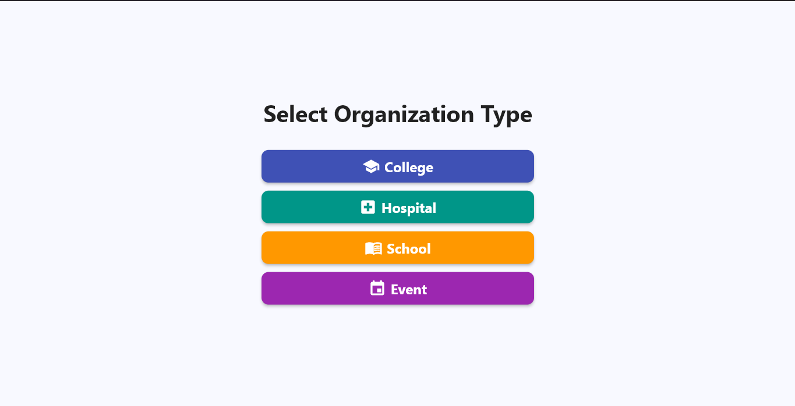
  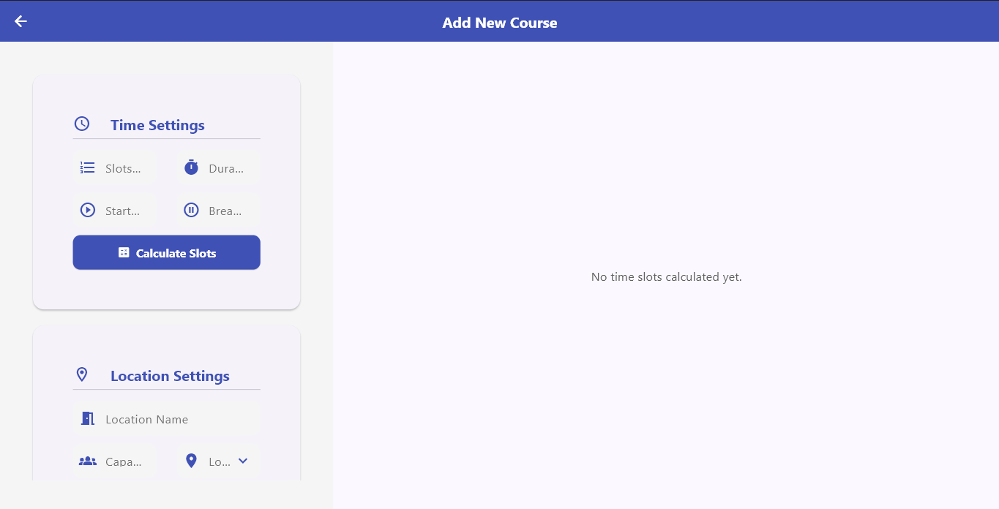
  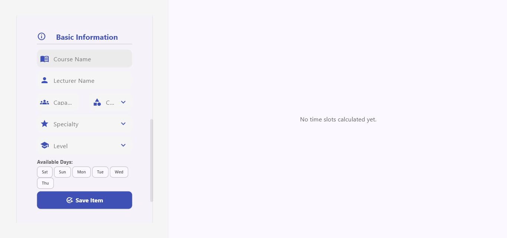
  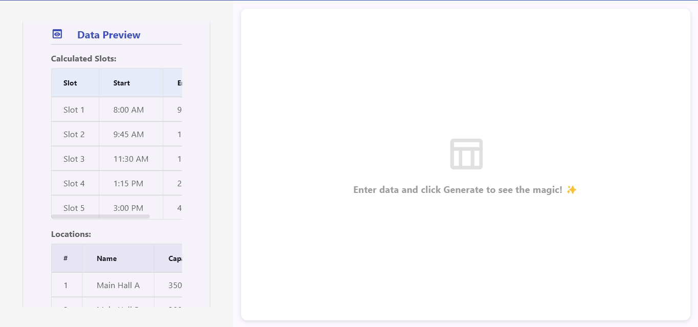
  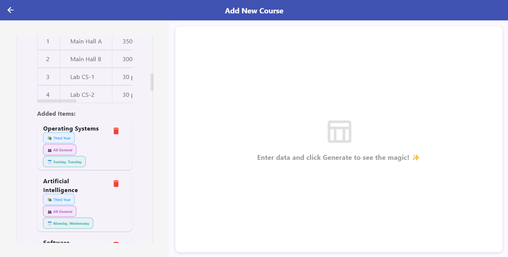
  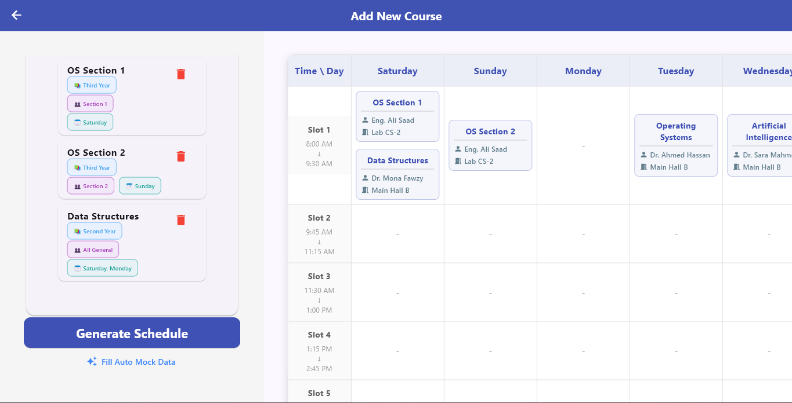
  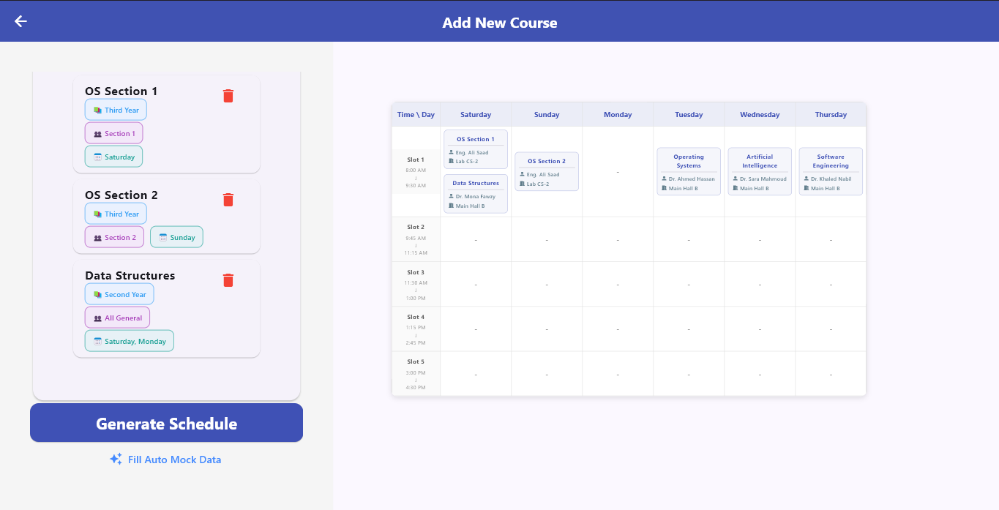
  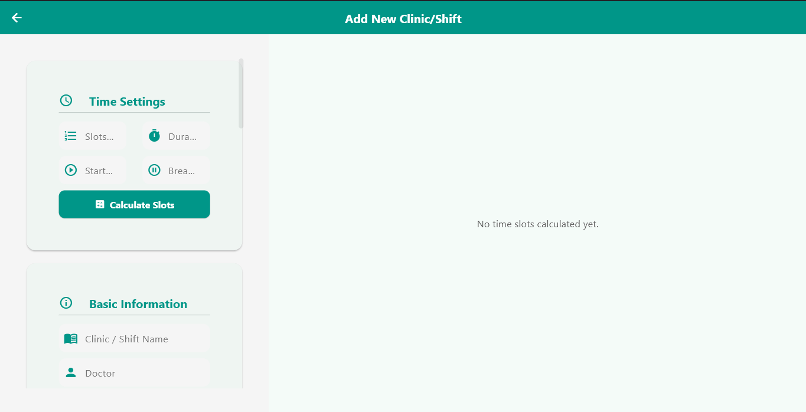
  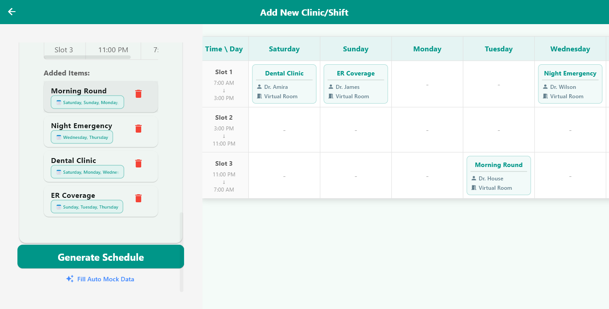
  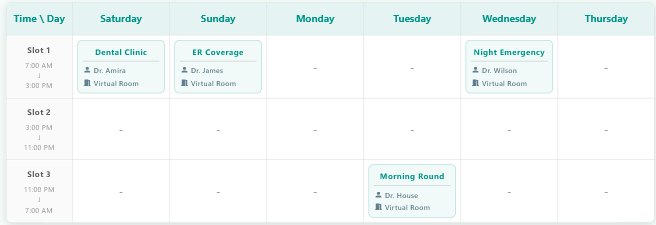
  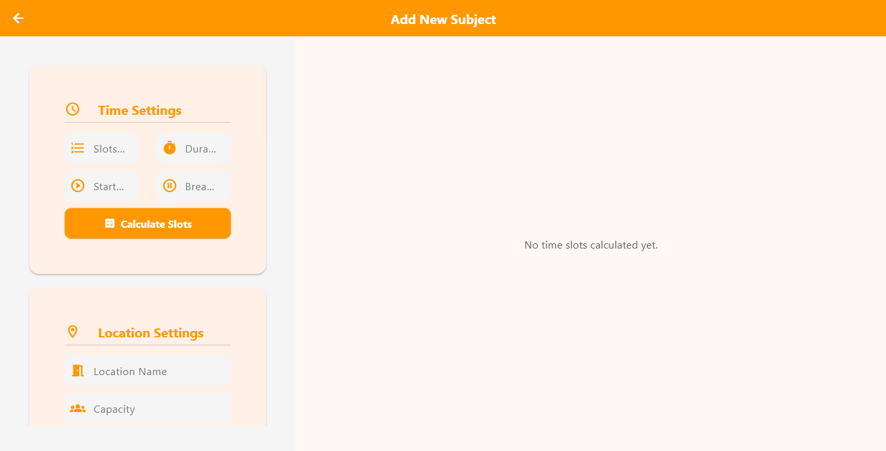
  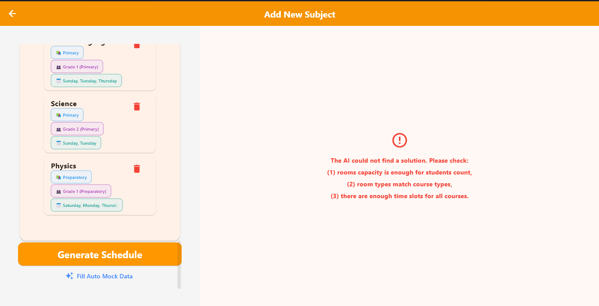
  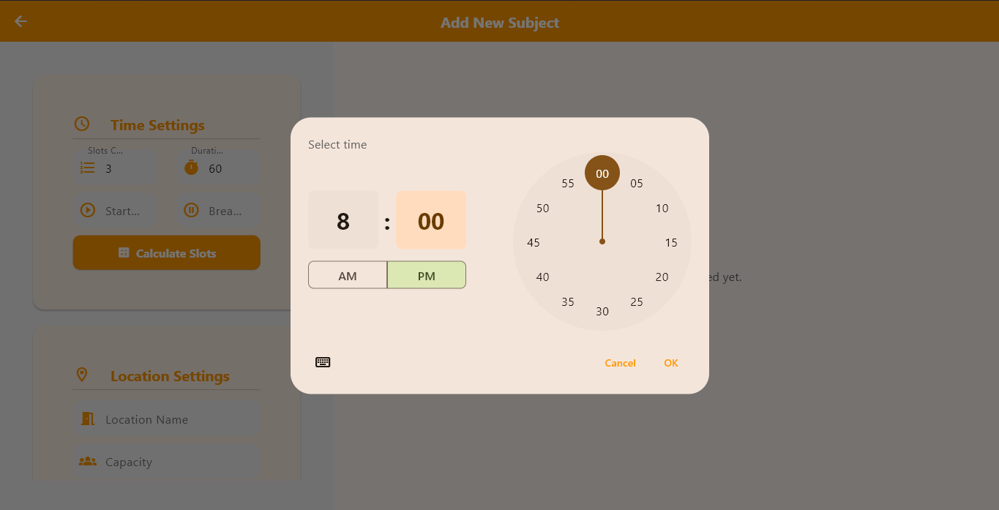
  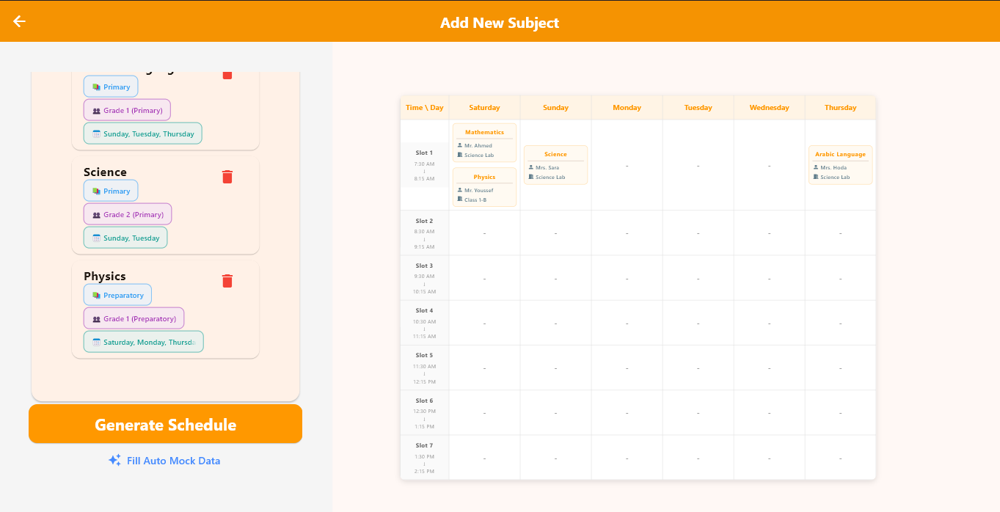
  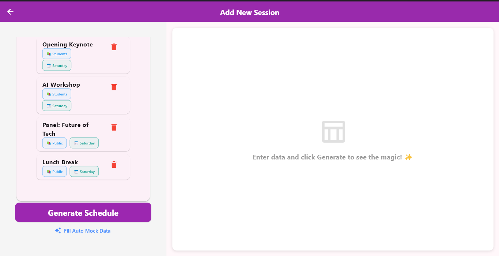
  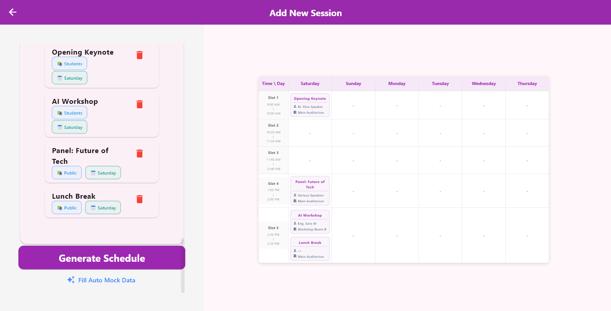
</p>

<p align="center">
  <i>"A seamless and interactive interface to manage courses, instructors, and locations."</i>
</p>

---

## ✨ Key Features
* 🧠 **AI Core:** Utilizes Google OR-Tools to ensure 100% conflict-free schedules.
* 📱 **Cross-Platform:** High-performance UI built with Flutter (Supports Desktop & Mobile).
* 💾 **Local Persistence:** Saves all your progress locally using **Hive** for instant access.
* ⚙️ **Highly Customizable:** Define your own slots, break durations, and specific constraints.
* 🔍 **Smart Constraints:** Automatically matches room types (Labs/Halls) with subject requirements.

---

## 🛠 Tech Stack

### Frontend
- **Flutter** (Framework)
- **Cubit/Bloc** (State Management)
- **Hive** (Local Storage)
- **Dio** (API Communication)

### Backend
- **Python** (Language)
- **FastAPI** (Web Framework)
- **Google OR-Tools** (AI/Optimization Engine)

---

## 🧠 How the AI Works
The system treats scheduling as a **Constraint Satisfaction Problem (CSP)**. 
1. **Hard Constraints:** No instructor in two places, no room double-booked, no overlapping batches.
2. **Optimization:** The solver minimizes "wasted space" by matching student counts to the most appropriate room capacity.

---

## 🚀 Getting Started

### 1. Backend Setup
```bash
# Navigate to backend folder
pip install fastapi uvicorn ortools pydantic
python api.py
```

### 2. Frontend Setup
```bash
# Get dependencies
flutter pub get

# Run the app
flutter run
```

